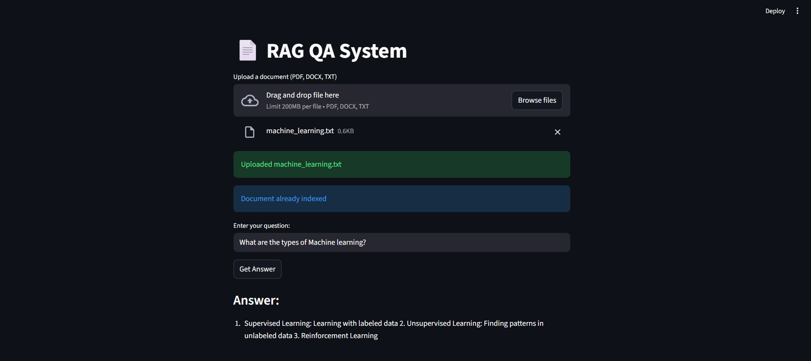

# 📄 RAG QA System (Retrieval-Augmented Generation)

A fully **interactive RAG system** that allows you to **ask questions on your documents**.  
Supports **PDF, DOCX, TXT**, automatic indexing, and CPU-friendly LLM-based answer generation.  

---

## **🚀 Features**

- **Live document upload**: Upload documents directly through the Streamlit interface.
- **Automatic indexing**: Uploaded documents are automatically chunked and embedded into FAISS.
- **Vector search**: FAISS efficiently retrieves the most relevant chunks for your query.
- **CPU-friendly generation**: Uses `Flan-T5 Small` model for lightweight, fast answers without GPU.
- **Plug-and-play**: Fully functional on Windows/Linux with <8GB RAM.
- **Open-source & free**: No API keys required.

---

## **📁 Folder Structure**

rag_faiss_project/<br>
├── data/ # Raw PDFs, DOCX, TXT <br>
├── embeddings/ # FAISS index + metadata<br>
├── rag/<br>
│ ├── ingestion.py # Load documents<br>
│ ├── chunking.py # Split text into chunks<br>
│ ├── embedding.py # Generate embeddings<br>
│ ├── vector_store.py # FAISS wrapper with incremental indexing<br>
│ ├── retrieval.py # Retrieve top-k relevant chunks<br>
│ └── generation.py # LLM-based answer generation<br>
├── app.py # Streamlit interface with live uploads<br>
├── requirements.txt # All dependencies<br>
└── README.md


---

## **💻 Installation**

1. **Clone the repository**

```bash
git clone https://github.com/yourusername/rag_faiss_project.git
cd rag_faiss_project
```

2. **Create a virtual environment**
```bash
python -m venv venv
# Windows
venv\Scripts\activate
# Linux / Mac
source venv/bin/activate
```

3. **Install dependencies**
```bash
pip install -r requirements.txt
```
---
## **📂 How to Use**

1. **Start the Streamlit app**
```bash
streamlit run app.py
```

2. **Upload documents**
- Click “Upload a document” in the UI.
- Supported file types: PDF, DOCX, TXT.
- New documents are automatically chunked, embedded, and added to FAISS.

3. **Ask questions**
* Enter your query in the text box.
* The system retrieves relevant chunks and generates an answer using the Flan-T5 small LLM.

---

## **⚙️ Technical Details**
**RAG Pipeline**
1. Data Ingestion
   * Loads PDF, DOCX, TXT files using PyPDF2 and python-docx.
2. Chunking
   * Splits text into overlapping chunks for better context coverage.
3. Embedding
   * Uses Sentence-Transformers (all-MiniLM-L6-v2) to convert chunks into embeddings.
4. Vector Database
   * Uses FAISS for fast similarity search.
   * Supports incremental updates when new documents are added.
5. Retrieval
   * Retrieves top-k relevant chunks for the query from FAISS.
6. Generation
   * Lightweight LLM (Flan-T5 Small) generates human-readable answers.
   * Fully CPU-friendly.

---

## **Optional Improvements**

* Multi-document uploads at once.
* Show indexed documents in UI.
* Real-time progress bar for large documents.
* Switch to larger LLM if more RAM is available.

---

## **💡 Advantages**

* Fully interactive: upload documents and query without touching code.
* Efficient: incremental FAISS indexing avoids reprocessing.
* Lightweight: runs on low-memory systems.
* Open-source: no paid API keys required.
* Interview-ready: demonstrates RAG pipeline, vector DB, embeddings, and LLM generation.

---

## **📌 Notes**

* Keep uploaded documents in data/ folder for persistent storage.
* FAISS index is saved in embeddings/faiss_index*.
* To reset the index, delete the embeddings folder and restart the app.

---

## **🎯 Summary**

This project is a production-grade RAG system suitable for:
* Document Q&A
* Knowledge management
* Research assistance
* Customer support automation

It’s fully modular, open-source, and demonstrates industry-level implementation of Retrieval-Augmented Generation.




---

## 👨‍💻 Author

<b>Musharraf Hussain Khan</b><br>
[GitHub](https://github.com/Musharraf1519)<br>
[LinkedIn](https://www.linkedin.com/in/musharraf-hussain-khan/)<br>
Email: musharrafhussainkhann@example.com
