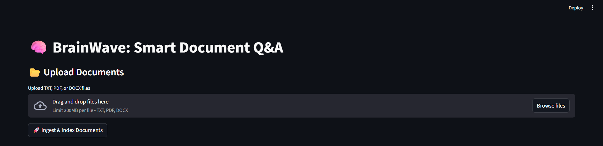
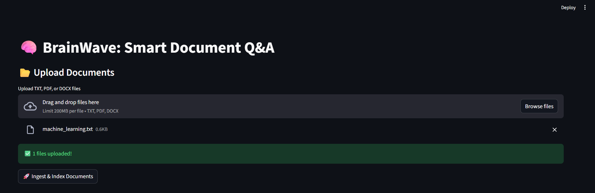

# 🧠 BrainWave: RAG Q&A with Pinecone

BrainWave is a **Retrieval-Augmented Generation (RAG) system** that allows users to **ask natural language questions** on large documents. It retrieves relevant information using **Pinecone vector database** and generates human-like answers using **open-source LLMs**.  

This project demonstrates a **production-ready modular RAG pipeline** suitable for interviews, research assistance, knowledge management, and document Q&A.

---

## **Features**

- 📂 Upload and ingest multiple documents (PDF, DOCX, TXT)
- 🧩 Automatic **chunking** of large documents
- ⚡ Generate **semantic embeddings** using `sentence-transformers`
- 💾 Store and query embeddings in **Pinecone vector database**
- 🤖 Answer queries using **Flan-T5 open-source LLM**
- 🌐 Interactive **Streamlit web interface**
- 🔧 Modular, production-ready code

---

## **Folder Structure**

rag_pinecone_project/<br>
├── app.py # Streamlit frontend<br>
├── requirements.txt # Python dependencies<br>
├── data/ # Uploaded documents stored here<br>
├── rag/<br>
│ ├── ingestion.py # Load documents<br>
│ ├── chunking.py # Split text into chunks<br>
│ ├── embedding.py # Generate embeddings<br>
│ ├── vector_store.py # FAISS wrapper with incremental indexing<br>
│ ├── retrieval.py # Retrieve top-k relevant chunks<br>
│ └── generation.py # LLM-based answer generation<br>

---


## **Installation**

1. **Clone the repository**
```bash
git clone https://github.com/yourusername/rag_pinecone_project.git
cd rag_pinecone_project
```
2. **Create and activate a virtual environment**
```bash
python -m venv venv
# Windows
venv\Scripts\activate
# Linux/Mac
source venv/bin/activate
```
3. **Install dependencies**
```bash
pip install -r requirements.txt
```
4. **Set Pinecone API key**
* Temporary (current session)
```bash
set PINECONE_API_KEY=your_api_key
```
* Permanent (all future sessions)
```bash
setx PINECONE_API_KEY "your_api_key"
```
### Close and reopen terminal

--- 

## **Usage**

1. Run Streamlit app
```bash
streamlit run app.py
```
2. Upload Documents
* Use the Upload Documents section to upload .pdf, .docx, or .txt files.
* Documents are saved automatically to the data/ folder.
3. Ingest & Index Documents
* Click 🚀 Ingest & Index Documents to:
    * Chunk documents
    * Generate embeddings
    * Upsert embeddings into Pinecone index
4. Ask Questions
* Enter a natural language query in the text input.
* The system will retrieve relevant chunks and generate a human-like answer.

---

## **Pipeline Overview**

1. Document Ingestion – Load files into memory
2. Chunking – Split large text into smaller overlapping chunks
3. Embedding – Convert chunks into semantic vectors
4. Vector DB (Pinecone) – Store embeddings for fast semantic search
5. Query Augmentation & Retrieval – Fetch top-k relevant chunks
6. Generation (LLM) – Generate natural language answer using context

---

## **Dependencies**

* streamlit – Web interface
* sentence-transformers – Embedding generation
* transformers – LLM for answer generation
* torch – Backend for transformers
* pinecone – Vector database
* PyPDF2 – PDF reading
* python-docx – DOCX reading

---

## **Future Improvements**

* Add .env support for API key
* Support more LLMs (CPU-friendly or GPU-based)
* Add document metadata search (author, date, etc.)
* Include logging & progress bars for ingestion
* Dockerize for easy deployment

---
## **📸 Screenshots**





---

## 👨‍💻 Author

<b>Musharraf Hussain Khan</b><br>
[GitHub](https://github.com/Musharraf1519)<br>
[LinkedIn](https://www.linkedin.com/in/musharraf-hussain-khan/)<br>
Email: musharrafhussainkhann@example.com
